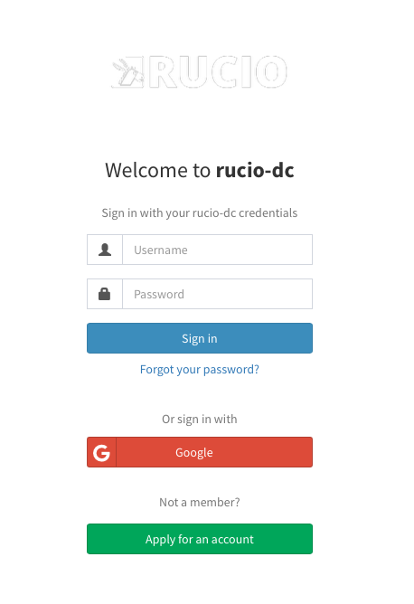

# Rucio-IAM

This is a INDIGO Identity and Access Management (IAM) Service repository for Rucio IAM tests

## Instructions:

### Clone this repository

```
git clone <this repo>
```

### Server certificates

You will need server certificates. After get this generated, they need to be available under **/etc/grid-security/**

### Disabling Thrustanchors 

There is an specific container to make Thrustanchors available.
This configuration can be supressed by commenting this lines on **Rucio-IAM/iam.env**

```
IAM_X509_TRUST_ANCHORS_DIR=/etc/grid-security/certificates
IAM_X509_TRUST_ANCHORS_REFRESH=14400
```

Comment on **docker-compose.yml** file:

```
  trust:
    image: indigoiam/egi-trustanchors
    volumes:
      - trustanchors:/etc/grid-security/certificates
      - cabundle:/etc/pki
```
Remove the volume mounting on iam container:

```
      - /etc/grid-security/:/etc/grid-security/
```

### NGINX configuration

Edit the **Rucio-IAM/assets/iam.conf **entries:
```
  server_name   YOUR_HOSTNAME_HERE;
  proxy_pass    http://THE_IAM_APP_HOSTNAME_HERE:8080;
```

### Database configuration

Edit the **Rucio-IAM/dbdata.env** and update the password

### JSON Web Keys configuration

Generate a JSON web key for your IAM deployment and update the **Rucio-IAM/assets/keystore.jwks**

Instructions: https://indigo-iam.github.io/v/v1.8.2/docs/getting-started/jwk/

### Basic IAM setup

Edit the Rucio-IAM/iam.env 

```
IAM_HOST=YOUR_IAM_HOST
IAM_DB_HOST=YOUR_DB_HOST
IAM_ACTUATOR_USER_USERNAME=user
IAM_ACTUATOR_USER_PASSWORD=changeme
IAM_DB_NAME=iam
IAM_DB_USERNAME=iam
IAM_DB_PASSWORD=changeme

```

### Start the containers:

```
docker-compose build -up -d
```

Now you should see 3 running containers and 1 stopped (thrustanchors):

```
(base) [root@server Rucio-IAM]# docker ps -a
CONTAINER ID   IMAGE                                COMMAND                  CREATED             STATUS                         PORTS                                           NAMES
56d5fc54c1a5   indigoiam/egi-trustanchors           "/update-trust-ancho…"   About an hour ago   Exited (0) About an hour ago                                                   rucioiam_trust_1
6a8ad2637211   mariadb:10.11                        "docker-entrypoint.s…"   About an hour ago   Up About an hour               0.0.0.0:3306->3306/tcp, :::3306->3306/tcp       db
2b2104263ee8   indigoiam/iam-login-service:v1.8.2   "/bin/sh -c 'java ${…"   About an hour ago   Up About an hour               0.0.0.0:8080->8080/tcp, :::8080->8080/tcp       rucioiam_iam_1
cd380abb4917   nginx                                "/docker-entrypoint.…"   About an hour ago   Up About an hour               80/tcp, 0.0.0.0:443->443/tcp, :::443->443/tcp   iam
```

In your web browser you can type https://YOUR_IAM_HOST




Reference: https://indigo-iam.github.io/v/v1.8.2/docs/